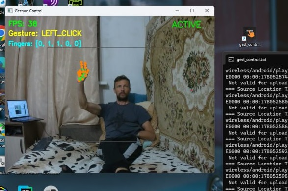

# Gesture Control

Управление мышью компьютера с помощью жестов руки через обычную веб-камеру — без дополнительного оборудования.



## Стек

| Библиотека | Версия | Роль |
|---|---|---|
| [MediaPipe](https://developers.google.com/mediapipe) | 0.10.35 | Детекция 21 landmark руки |
| OpenCV | 4.13 | Захват и отображение кадра |
| PyAutoGUI | 0.9.54 | Управление мышью |
| NumPy | 2.4 | Сглаживание координат |
| Python | 3.11 / 3.12 | — |

---

## Установка

```bash
# Python 3.11 или 3.12
py -3.11 -m venv .venv
.venv\Scripts\activate          # Windows
# source .venv/bin/activate     # Linux / macOS

pip install -r requirements.txt
```

При первом запуске автоматически скачается файл модели `hand_landmarker.task` (~8 МБ).
Либо скачайте вручную заранее:

```bash
python -c "
import urllib.request
urllib.request.urlretrieve(
    'https://storage.googleapis.com/mediapipe-models/hand_landmarker/hand_landmarker/float16/1/hand_landmarker.task',
    'hand_landmarker.task'
)
"
```

---

## Запуск

```bash
python main.py
```

Программа стартует в режиме **PAUSED** — мышь не двигается.
Откроется окно с камерой, статус отображается в правом верхнем углу.

**Выход** — клавиша `ESC`.
**Аварийная остановка** — сдвиньте мышь в любой угол экрана (PyAutoGUI FAILSAFE).

---

## Активация и деактивация

Программа специально стартует в паузе, чтобы не мешать при работе за столом.

**Жест-переключатель:** большой палец + мизинец 🤙 ("shaka"), удержать **2 секунды**.

```
PAUSED  →  покажите shaka, держите 2 сек  →  ACTIVE
ACTIVE  →  покажите shaka, держите 2 сек  →  PAUSED
```

В окне камеры внизу появляется прогресс-бар обратного отсчёта.
Статус в правом верхнем углу: **зелёный ACTIVE** / **красный PAUSED**.

---

## Жесты управления

Жест засчитывается по статичной позиции руки. Держите позицию чётко — без смазанных переходов.

| Жест | Показываете | Действие |
|---|---|---|
| **MOVE** | ☝️ Только указательный | Курсор следует за кончиком пальца |
| **LEFT_CLICK** | ✌️ Указательный + средний | Левый клик в текущей позиции |
| **RIGHT_CLICK** | 👍 Только большой | Правый клик |
| **DRAG** | ✊ Кулак (все опущены) | Зажать ЛКМ и двигать |
| **RELEASE** | 🖐 Открытая ладонь | Отпустить зажатую кнопку |
| **SCROLL_UP** | 🤘 Указательный + мизинец | Прокрутка вверх |
| **SCROLL_DOWN** | 🤙 Большой + указательный + мизинец | Прокрутка вниз |
| **TOGGLE** | 🤙 Большой + мизинец, удержать 2 с | Переключить ACTIVE / PAUSED |

> Между жестами-кликами и скроллом действует задержка 0.8 с — защита от случайных повторных срабатываний.

---

## Как это работает

```
Кадр с камеры (640×480)
        ↓
  зеркальный переворот (cv2.flip)
        ↓
  MediaPipe HandLandmarker
  → 21 точка суставов руки + handedness
        ↓
  fingers_up(): геометрическое сравнение координат
  → [0/1, 0/1, 0/1, 0/1, 0/1]
        ↓
  GestureRecognizer: словарь кортежей
  → название жеста
        ↓
  MouseController: PyAutoGUI (только в режиме ACTIVE)
  → действие на ПК
```

**21 landmark руки:**

```
        8   12  16  20
        |   |   |   |
    4   7   11  15  19
    |   6   10  14  18
    3   5---9---13--17
    2   |
    1   |
    0   <- запястье (WRIST)
```

Для пальцев 2–5: если кончик (tip) выше основания (MCP) по вертикали — палец поднят.
Для большого пальца: отведённость определяется по горизонтали с учётом руки (left/right).

Координаты курсора усредняются по последним 8 кадрам (скользящее среднее) для устранения дрожания.

---

## Настройка

Все параметры в [config.py](config.py):

```python
CAMERA_INDEX     = 0      # индекс камеры (0 = встроенная)
FRAME_WIDTH      = 640    # ширина кадра
FRAME_HEIGHT     = 480    # высота кадра

SMOOTHING_FACTOR = 8      # кол-во кадров для усреднения
GESTURE_COOLDOWN = 0.8    # минимальный интервал между кликами/скроллом (сек)

# Активная зона — центральная часть кадра маппируется на весь экран
# 0.0 = весь кадр (близко к камере)
# 0.20 = центральные 60% кадра (рекомендуется для расстояния 1.5-2 м)
ACTIVE_ZONE_MARGIN = 0.20

# Качество детекции: снижайте для работы с расстояния
MIN_DETECTION_CONFIDENCE = 0.5   # 0.7 для стола, 0.5 для дивана
MIN_TRACKING_CONFIDENCE  = 0.6

TOGGLE_HOLD_SEC  = 2.0    # секунд удержания shaka для переключения
```

### Рекомендации по расстоянию

| Расстояние | `ACTIVE_ZONE_MARGIN` | `SMOOTHING_FACTOR` | `MIN_DETECTION_CONFIDENCE` |
|---|---|---|---|
| ~50 см (стол) | `0.0` | `5` | `0.7` |
| ~1 м | `0.10` | `6` | `0.6` |
| ~1.5-2 м (диван) | `0.20` | `8` | `0.5` |

---

## Условия для хорошей работы

- **Освещение** — равномерный свет спереди, без засветки фона и теней на руке
- **Фон** — однородный (однотонная стена работает лучше пёстрого стола)
- **Расстояние** — рука полностью в кадре внутри серой рамки активной зоны
- **Позиции** — чёткие и статичные; задержитесь в позиции ~0.5 сек

---

## Структура проекта

```
gesture_control/
├── main.py                # точка входа, главный цикл, toggle логика
├── hand_tracker.py        # обёртка MediaPipe Tasks API
├── gesture_recognizer.py  # логика жестов (чистый Python, без зависимостей)
├── controller.py          # действия мышью через PyAutoGUI, активная зона
├── config.py              # все настраиваемые параметры
├── hand_landmarker.task   # модель MediaPipe (скачивается автоматически)
├── requirements.txt
├── CHANGES.md             # журнал изменений
└── CLAUDE.md              # документация для AI-ассистента
```

---

## Идеи для улучшения

### Плавность и точность

**Фильтр Калмана вместо скользящего среднего**
Текущее усреднение по N кадрам даёт задержку курсора. Фильтр Калмана предсказывает позицию и сразу реагирует на резкие движения без видимого «запаздывания». Готовая реализация — `pykalman` или написать двумерный KF вручную (~30 строк).

**Debounce — жест N кадров подряд**
Сейчас жест засчитывается с первого кадра. Достаточно подержать позицию 3–5 кадров, чтобы отсечь случайные срабатывания при переходах между жестами.

### Новые жесты

**Динамические жесты (движение, не поза)**
Буфер последних N кадров + распознавание паттернов движения:
- взмах вверх/вниз — листание страниц
- круговое движение — переключение вкладок / регулировка громкости
- щипок двумя пальцами — zoom in/out

**ML-классификатор жестов**
Записать датасет (~200 примеров каждого жеста, 42 числа на кадр = 21 точка × 2 координаты), обучить `sklearn.RandomForestClassifier` или небольшой MLP. Преимущества: новые жесты добавляются без правки кода, лучше справляется с нестандартными углами руки.

**Жесты двумя руками**
Установить `num_hands=2`. Вторая рука как модификатор режима: правая управляет мышью, левая переключает профиль (браузер / медиаплеер / презентация).

### Производительность

**Асинхронная обработка (`LIVE_STREAM`)**
Перевести MediaPipe на `RunningMode.LIVE_STREAM` + обрабатывать кадры в отдельном потоке. Прирост ~15–20% FPS за счёт параллельного захвата и инференса.

### Качество жизни

| Улучшение | Сложность | Описание |
|---|---|---|
| Профили жестов | Средняя | Переключаемые наборы: мышь / медиа / браузер |
| Debounce (N кадров) | Простая | Меньше ложных кликов при переходах |
| Горячая клавиша паузы | Простая | Глобальный хоткей через `pynput` |
| Запись макросов | Средняя | Серия жестов как один макрос |
| Системный трей | Средняя | Фоновая работа без открытого окна |

---

## Скоро

**Тренировочная мини-игра** — интерактивный тренажёр жестов прямо в окне камеры:
появляются цели на экране, нужно навести курсор и кликнуть жестом в нужное время.
Поможет освоить управление и набить мышечную память до автоматизма.

---

## Известные ограничения

- Работает с одной рукой (по умолчанию)
- Только статичные позиции, нет динамических жестов
- Качество сильно зависит от освещения
- MediaPipe 0.10.x не поддерживает Python 3.13+

---

## Лицензия

MIT
